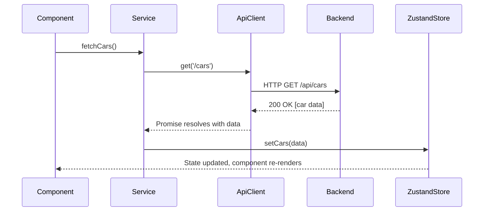

# Frontend Architecture Documentation: Auto88

This document provides a comprehensive overview of the Auto88 frontend application, detailing its architecture, data flow, core features, and recommendations for future development.

## 1. Project Overview

The Auto88 frontend is a modern single-page application (SPA) built using **React** and **TypeScript**. It is bootstrapped with **Vite** for a fast development experience. The project utilizes a robust and scalable architecture, with a clear separation of concerns that makes it easy to maintain and extend.

- **Framework**: React 18+
- **Language**: TypeScript
- **Build Tool**: Vite
- **Styling**: Tailwind CSS with ShadCN/UI for component primitives.
- **State Management**: Zustand
- **Routing**: React Router DOM
- **API Communication**: Axios

## 2. Folder Structure

The `src` directory is organized by feature and responsibility, promoting modularity and code reusability.

```
src/
├── assets/         # Static assets like images, fonts, etc.
├── components/     # Reusable UI components shared across the application.
│   ├── ui/         # Generic, low-level components (Button, Card, Input).
│   └── sections/   # More complex, feature-specific components (e.g., HeroSection).
├── layouts/        # Components that define the overall structure of pages (e.g., MainLayout, AdminLayout).
├── pages/          # Top-level components for each route/view in the application.
├── routes/         # Application routing configuration.
├── services/       # Handles all API communication, organized by domain (e.g., carService, authService).
├── store/          # Global state management using Zustand, with stores for different features.
├── lib/            # Core utilities and helper functions, including the central API client.
└── ...
```

- **`pages/`**: Each file in this directory corresponds to a specific page (e.g., `HomePage.tsx`, `CarDetailsPage.tsx`). These components are responsible for fetching data via `services` and displaying it using components from `components/`.
- **`components/`**: Contains reusable UI elements. The `ui/` subdirectory holds generic, unstyled components (often from a library like Radix UI), while other folders contain more complex, application-specific components.
- **`layouts/`**: These are wrapper components that provide a consistent structure. For example, `MainLayout.tsx` includes the main header and footer, while `AdminLayout.tsx` includes the admin sidebar and header.
- **`services/`**: This is the data layer. Each service file (e.g., `carService.ts`) encapsulates the logic for making API calls to a specific set of backend endpoints. They use the central Axios instance defined in `lib/apiClient.ts`.
- **`store/`**: This directory contains Zustand store definitions. Each file (e.g., `useAuthStore.ts`) manages a specific slice of the application's global state, providing both the state and the actions to modify it.
- **`lib/`**: Contains shared utility functions. The most important file here is `apiClient.ts`, which configures a global Axios instance with interceptors for handling authentication tokens and API errors.
- **`routes/`**: The `AppRoutes.tsx` file defines all the application's routes, mapping URL paths to their corresponding page components and protecting routes that require authentication.

## 3. Data Flow

The application follows a unidirectional data flow, which makes state changes predictable and easy to debug.

1.  **Component Action**: A user interaction in a React component (e.g., a button click or a page load via `useEffect`) triggers a data request.
2.  **Service Call**: The component calls a function from a `service` file (e.g., `carService.fetchCars()`).
3.  **API Request**: The service function uses the centralized `apiClient` to make an HTTP request to the backend. The `apiClient` automatically attaches the authentication token to the request headers.
4.  **Backend Response**: The backend processes the request and sends back a response (data or an error).
5.  **State Update**: The service function receives the response and updates the global state using a function from a Zustand `store` (e.g., `useCarStore.getState().setCars(data)`).
6.  **UI Re-render**: Components subscribed to that part of the Zustand store automatically re-render to display the new data.

**Example Data Flow:**



## 4. Core Implemented Features

Based on the project structure, the following core features are already implemented:

-   **User Authentication**: User login and registration, with JWT-based authentication handled via the `authService` and `useAuthStore`.
-   **Protected Routes**: A `ProtectedRoute` component ensures that only authenticated users can access certain pages (e.g., user profile, admin panel).
-   **Car Listings**: Displaying lists of cars, car details, and featured car sections.
-   **News/Blog**: A section for news articles with a list view and a detail view.
-   **Order Management**: Users can view their order history, and administrators can manage all orders.
-   **Admin Panel**: A comprehensive dashboard for administrators to manage:
    -   Cars
    -   News
    -   Orders
    -   Users
    -   Promotions
    -   Payments
-   **Car Comparison**: A feature allowing users to compare different cars.

## 5. Backend Integration

The frontend communicates with the backend via a RESTful API.

-   **API Client**: A single, pre-configured Axios instance is defined in `src/lib/apiClient.ts`. This is the recommended way to make all HTTP requests.
-   **Base URL**: The API base URL should be configured using environment variables (e.g., `VITE_API_BASE_URL` in a `.env` file) and is likely set in the `apiClient`.
-   **Authentication**: An Axios request interceptor in `apiClient.ts` automatically adds the `Authorization: Bearer <token>` header to every outgoing request, retrieving the token from the `useAuthStore`.
-   **Error Handling**: A response interceptor is in place to catch API errors globally. It specifically handles `401 Unauthorized` errors by logging the user out, which is a robust pattern for managing expired sessions.

## 6. Analysis and Recommendations

The project has a solid foundation. The following are observations and recommendations for improvement.

### Missing or Incomplete Parts

1.  **Testing**: There are no visible unit, integration, or end-to-end tests. This is the most critical missing piece for ensuring code quality and preventing regressions.
2.  **Global Loading & Error States**: While data fetching is implemented, there doesn't appear to be a standardized, global system for handling UI loading states (e.g., spinners) and displaying user-friendly error messages. This is likely handled on a per-component basis, which can lead to inconsistency.
3.  **Environment Configuration**: The method for handling environment variables (e.g., `.env` files for the API URL) is not explicitly visible and should be standardized.

### Suggestions for Improvement

1.  **Implement a Testing Strategy**:
    -   **Unit Tests**: Use **Vitest** and **React Testing Library** to test individual components and utility functions.
    -   **Integration Tests**: Test how multiple components work together, such as form submissions.
    -   **Recommendation**: Start by writing tests for the `services` and `store` to ensure the core business logic is reliable.

2.  **Standardize State Management Logic**:
    -   Currently, components might be calling services directly and then updating the store. A more robust pattern is to have the store actions responsible for calling the services. This co-locates async logic and state updates, making components simpler.
    -   **Example (before)**: `component -> service -> store`
    -   **Example (recommended)**: `component -> store action -> service -> store update`

3.  **Create a `useApi` Hook**:
    -   To standardize loading and error handling, create a custom hook (e.g., `useApi`) that wraps the service calls. This hook can manage `isLoading`, `error`, and `data` states, reducing boilerplate in components.
    -   **Example Usage**: `const { data, isLoading, error } = useApi(carService.fetchCars);`

4.  **Add Storybook for Component Development**:
    -   The `src/components/ui` directory is perfect for a component library. Using **Storybook** would allow for developing and documenting these components in isolation, improving reusability and consistency.

5.  **Formalize Environment Variables**:
    -   Ensure that all external configuration (especially `VITE_API_BASE_URL`) is managed through `.env`, `.env.development`, and `.env.production` files and is properly documented in the `README.md`.
